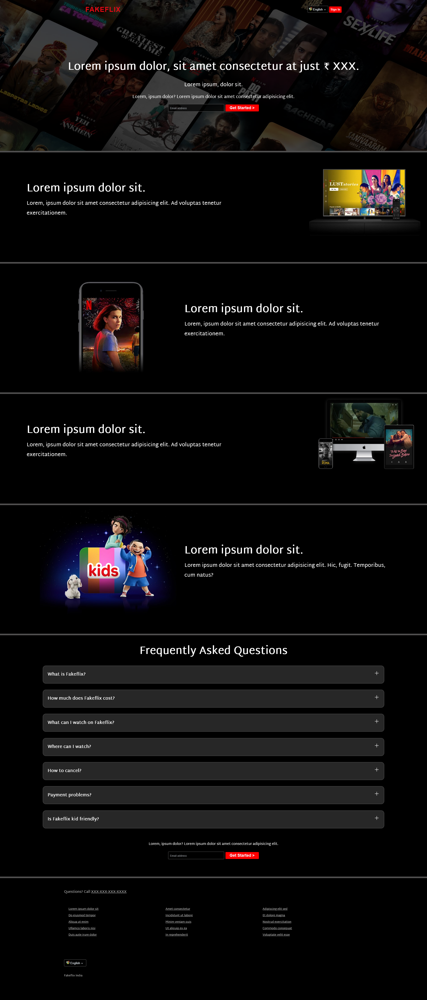

# Streaming UI Platform (Landing Page) 🎬

[](https://developer.mozilla.org/en-US/docs/Web/HTML)
[](https://developer.mozilla.org/en-US/docs/Web/CSS)

## Overview

Hi! I'm **Dipsana**, and this is a **Netflix India (2023) inspired landing page** built to practice **HTML and CSS**.

> ⚠️ **Note:** This is a static, dummy website. Features like sign-in, language selection, and other dynamic functionality **do not work**.

The page replicates the **look and feel of Netflix** using only **HTML and CSS** — no JavaScript is involved.

---

## Educational Purpose Notice

This is a frontend UI demonstration for learning purposes only.
Not affiliated with any streaming service. Does not include actual
streaming functionality or proprietary content.

---

## Features

- Modern **landing page interface** similar to Netflix.
- Fully responsive layout.
- Includes **videos, images, and custom fonts**.
- Clean and organized **HTML and CSS structure**.

---

## Clickable Repository Structure

.  
├─ [assets](./assets)  
│  ├─ [images](./assets/images)             # Images used in the page  
│  ├─ [martel-sans](./assets/martel-sans)   # Font files  
│  └─ [videos](./assets/videos)             # Demo videos  
├─ [favicon.png](./favicon.png)             # Favicon  
├─ [index.html](./index.html)               # Main landing page  
└─ [style.css](./style.css)                 # Styling for the page  

---

## How to Use

1. **Clone the repository:**

    ```bash
    git clone https://github.com/dipsana/streaming-platform-ui.git
    ```

2. **Open `index.html`** in your browser to see the landing page.

---

## Preview



---

## License

This project is open for learning and personal use. Feel free to explore and modify it.

---

Made with ❤️ by **Dipsana**
